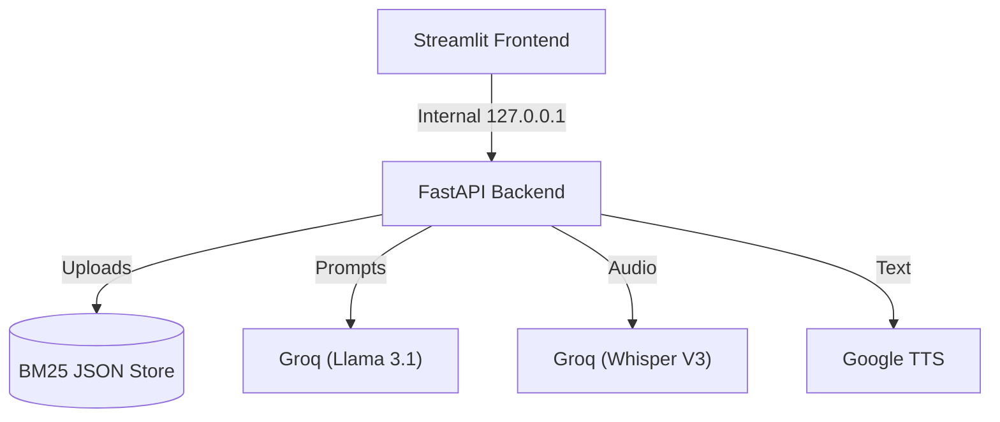

# 🗣️ EchoRAG — Cloud-Native Voice RAG Assistant

A lightning-fast, highly optimized Retrieval-Augmented Generation (RAG) assistant designed for instant cloud deployments (like Render's Free Tier). EchoRAG lets you upload documents, create topic-specific projects, and ask questions via text or voice.

**[🌐 Live App](https://echorag.onrender.com)** | **[📖 API Docs](https://echorag.onrender.com/docs)** | **[🩺 Backend Health](https://echorag.onrender.com/health)**

## ⚡ Tech Stack

- **Frontend:** Streamlit, Vanilla CSS (Glassmorphism)
- **Backend:** FastAPI, Python 3.12, Uvicorn
- **AI Models:** Groq API (`llama-3.1-8b`, `whisper-large-v3`)
- **Vector Search:** `rank-bm25` (Pure Python TF-IDF Keyword matching)
- **Deployment:** Docker, Render (Free Tier Optimized)

## 🚀 Key Features

- **Project-Based Knowledge** — Create isolated projects (e.g., Physics, Biology) to keep your document collections organized.
- **Ultra-Lightweight Vector Store** — Replaced memory-heavy ChromaDB with a pure Python `BM25` search algorithm + JSON persistence, dropping memory usage by >90%.
- **Cloud-Native AI** — Powered entirely by the blazing-fast **Groq API**:
  - `llama-3.1-8b-instant` for LLM inference
  - `whisper-large-v3` for robust Voice-to-Text transcription
- **Dockerized & Self-Healing** — Features a custom Python process manager (`launcher.py`) that boots FastAPI and Streamlit safely and cleanly restarts on OOMs.
- **Premium Dark UI** — Streamlit frontend styled with glassmorphism and modern gradient aesthetics.

## 🏗️ Architecture



## 🛠️ Project Structure

```
EchoRAG/
├── app/
│   ├── main.py                 # FastAPI Application Factory
│   ├── api/routes.py           # REST Endpoints (/ask, /upload, /voice)
│   ├── frontend/streamlit_app.py # Premium UI
│   ├── ingestion/              # PDF & TXT Chunking Logic
│   ├── llm/llm_engine.py       # Groq API Integration
│   ├── rag/rag_pipeline.py     # Orchestration
│   ├── retrieval/retriever.py  # BM25 Search Engine
│   ├── utils/config.py         # Env Variables Config
│   ├── vectorstore/chroma_db.py # Legacy name, now pure BM25 Core
│   └── voice/                  # Groq Whisper STT & gTTS
├── launcher.py                 # Self-healing Process Manager
├── Dockerfile                  # Cloud Deployment Definition
├── render.yaml                 # Render Blueprint
└── requirements.txt            # Minimal Cloud Dependencies
```

## 💻 Local Development Setup

### 1. Prerequisites
- Python 3.12+
- A [Groq API Key](https://console.groq.com/keys)

### 2. Installation
```bash
git clone https://github.com/yourusername/EchoRAG.git
cd EchoRAG

python3 -m venv venv
source venv/bin/activate
pip install -r requirements.txt
```

### 3. Environment Variables
Create a `.env` file in the root directory (or simply export it):
```bash
export GROQ_API_KEY="gsk_your_api_key_here"
```

### 4. Run the Application
The easiest way to replicate the cloud environment locally is to use the custom launcher:
```bash
python launcher.py
```
This will cleanly boot FastAPI on port `8000` and Streamlit on port `8501`. 
Open `http://localhost:8501` to use the app!

## ☁️ Cloud Deployment (Render.com)

This application is meticulously optimized to run flawlessly on the **Render Free Tier** (512MB RAM).

1. Go to [Render.com](https://render.com) and create a new **Web Service**.
2. Connect your GitHub repository.
3. Render will automatically detect the `render.yaml` Blueprint file.
4. Add your **`GROQ_API_KEY`** in the Render Environment Variables tab.
5. Deploy!

The custom `launcher.py` and strictly bound `127.0.0.1` internal routing ensures that standard Docker connection bugs are completely eliminated in the cloud sandbox.

## 📡 API Endpoints

| Method | Endpoint | Description |
|--------|----------|-------------|
| GET    | `/health` | Health Check |
| POST   | `/upload?project=xyz` | Ingests a PDF/TXT into the BM25 store |
| POST   | `/ask` | Ask a RAG question (JSON Body: `{"query": "...", "project": "xyz"}`) |
| GET    | `/projects` | List created projects |
| POST   | `/projects/create?name=xyz`| Create a new project index |
| POST   | `/voice/transcribe` | Upload `.wav` to Groq Whisper for STT |
| POST   | `/voice/ask` | Full Audio-in, RAG, Audio-out pipeline |

## 📜 License

MIT License
