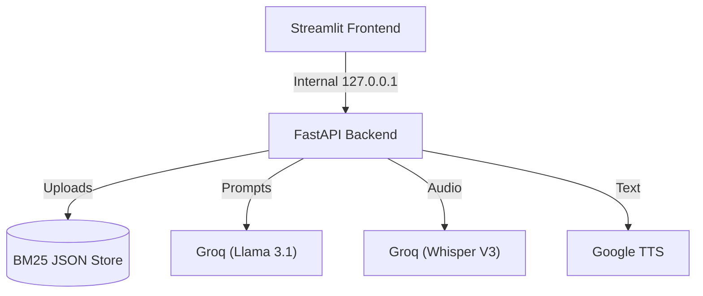

# 🗣️ EchoRAG — Cloud-Native Voice RAG Assistant

A lightning-fast Retrieval-Augmented Generation (RAG) assistant designed for instant cloud deployment. Upload documents, create topic-specific projects, and ask questions via text or voice.

**[🌐 Live App](https://echorag.onrender.com)** | **[📖 API Docs](https://echorag.onrender.com/docs)** | **[🩺 Backend Health](https://echorag.onrender.com/health)**

---

## ⚡ Tech Stack
- **UI:** Streamlit, Vanilla CSS (Glassmorphism)
- **API:** FastAPI, Python 3.12, Uvicorn
- **AI Models:** Groq API (`llama-3.1-8b`, `whisper-large-v3`)
- **Search:** `rank-bm25` (Pure Python TF-IDF Keyword matching)
- **Infra:** Docker, Render (Free Tier Optimized)

## 🚀 Key Features
- **Project Workspaces** — Isolate documents into specific projects (e.g., Physics, Biology).
- **Ultra-Lightweight** — Replaced memory-heavy ChromaDB with pure Python BM25 JSON persistence, cutting RAM usage by >90%.
- **Voice Native** — Speak your questions using Groq Whisper V3 for instant transcription.
- **Fail-Safe Docker** — Custom Python `launcher.py` boots FastAPI and Streamlit concurrently and cleanly auto-restarts on OOMs.

---

## 🏗️ Architecture



---

## 💻 Local Setup

You can run EchoRAG locally exactly how it runs in the cloud.

### 1. Install Dependencies
Ensure you have **Python 3.12+** installed.
```bash
git clone https://github.com/yourusername/EchoRAG.git
cd EchoRAG

python3 -m venv venv
source venv/bin/activate
pip install -r requirements.txt
```

### 2. Set API Key
Create a `.env` file or export your [Groq API Key](https://console.groq.com/keys):
```bash
export GROQ_API_KEY="gsk_your_api_key_here"
```

### 3. Launch the App
Use the custom process manager to automatically start and sync both the frontend and backend:
```bash
python launcher.py
```
👉 **Open `http://localhost:8501` to use the app!**

---

## ☁️ Cloud Deployment (Render)

EchoRAG is optimized to run flawlessly within Render's 512MB Free Tier.

1. Create a new **Web Service** on [Render.com](https://render.com).
2. Connect this GitHub repository.
3. Render will auto-detect the `render.yaml` configuration.
4. Add `GROQ_API_KEY` to the **Environment Variables** tab.
5. Click **Deploy**.

*The custom `launcher.py` ensures 127.0.0.1 internal networking works perfectly inside Render's Docker sandbox.*

---

## 📡 Core API Endpoints

| Method | Endpoint | Description |
|--------|----------|-------------|
| **POST** | `/upload?project=xyz` | Ingests a PDF/TXT into the BM25 store |
| **POST** | `/ask` | Process a RAG query |
| **POST** | `/projects/create?name=xyz`| Create a new project workspace |
| **POST** | `/voice/transcribe` | Upload `.wav` for Voice-to-Text |

## 📜 License
MIT License
